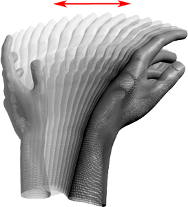

# SwipeGesture

属性：

* [direction](#direction)
* [pointable](#pointable)
* [position](#position)
* [speed](#speed)
* [start_position](#start_position)
* [class_type](#class_type)


## ***class*** **Leap.SwipeGesture**
扩展自 [Gesture](../api/Leap.Gesture.md)

SwipeGesture(滑动手势) 类表示一个滑动运动的手指或工具。


SwipeGesture 对象会生成每个手指或工具的滑动。

重要：要在应用中使用滑动手势，你需要激活滑动手势识别。你可以通过下面的代码激活这种识别：

```python
controller.enable_gesture(Leap.Gesture.TYPE_SWIPE);
```

你可以设置识别手势距离的最小值。使用虾米那的键值可以设置这个手势的识别：

|键值|值类型|默认值|单位|
|:--:|:--:|:--:|:--:|:--:|
|Gesture.Swipe.MinLength|float|150|mm|
|Gesture.Swipe.MinVelocity|float|1000|mm/s|

下面的代码展示了如何设置这些值：

```python
controller.config.set("Gesture.Swipe.MinLength", 100.0)
controller.config.set("Gesture.Swipe.MinVelocity", 750)
controller.config.save()
```

*New in Version 1.0*

### 构造函数
*classmethod* **SwipeGesture([gesture])**

从 Gesture 类实例中构造一个 SwipeGesture 对象。

```python
for gesture in frame.gestures():
    if gesture.type is Leap.Gesture.TYPE_SWIPE:
        swipe = Leap.SwipeGesture(gesture)
```

参数：

gesture([Gesture](../api/Leap.Gesture.md)) - Gesture 实例专用。这个 Gesture 实例必须是一个 SwipeGesture 对象。如果没有给出参数，那么一个无效的 SwipeGesture 对象会被创建。

*New in Version 1.0*

----

### 属性

**start_position**

类型：[Vector](../api/Leap.Vector.md)

滑动手势的起始位置。

```python
start = swipe.start_position
```

*New in Version 1.0*

--

**position**

类型：[Vector](../api/Leap.Vector.md)

滑动手势的当前位置

```python
current = swipe.position
```

*New in Version 1.0*

--

**direction**

滑动手势运动方向的单位向量。

```python
direction = swipe.direction
```

你可以比较向量的分量来对不同的手势进行类分。例如，如果你使用滑动手势来进行二维滚动，你可以比较横轴和竖轴的 x 和 y 值。

*New in Version 1.0*

--

**speed**

类型：float

滑动速度，mm/s 为单位。

```python
velocity = swipe.speed
```

*New in Version 1.0*

--

**pointable**

类型：[Pointable](../api/Leap.Pointable.md)

执行滑动手势的手指。

```python
swipper = swipe.pintable
```

*New in Version 1.0*

----

### 类属性
*classmethod* **class_type()**

类型：integer

滑动手势类型指示器：`Gesture.TYPE_SWIPE`
