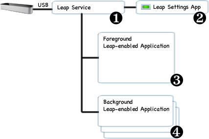
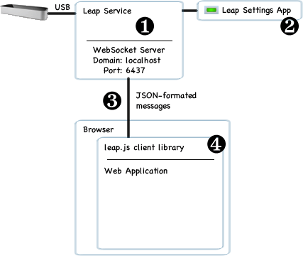

# 系统架构

LeapMotion 软件会作为一个服务(Windows)或后台(Mac 或 Linux)运行。软件通过 USB 线连接了 LeapMotion 控制器设备。支持 Leap 的应用可以访问 LeapMotion 服务收到运动的追踪数据。LeapMotion SDK 提供了两种风格的 API 来获取 LeapMotion 数据：本地接口以及 WebSocket 接口。这些 API 能使你通过各种不同的编程语言甚至浏览器环境中的 JavaScript 创建支持 Leap 的应用程序。

<!--The Leap Motion software runs as a service (on Windows) or daemon (on Mac and Linux). The software connects to the Leap Motion Controller device over the USB bus. Leap-enabled applications access the Leap Motion service to receive motion tracking data. The Leap Motion SDK provides two varieties of API for getting the Leap Motion data: a native interface and a WebSocket interface. These APIs enable you to create Leap-enabled applications in several programming languages including JavaScript running in a browser environment.-->

## 应用程序接口
LeapMotion SDK 提供了两种方式的 API 从 LeapMotion 服务中获得追踪数据：本地接口和 WebSocket 接口。本地接口是一个动态链接库，你可以使用这个动态链接库来创建支持 Leap 的新程序。WebSocket 接口以及 JavaScript 库可以让你创建支持 Leap 的 Web 程序。

<!--
Application Programming Interfaces
The Leap Motion SDK provides two varieties of API to get tracking data from the Leap Motion service: a native interface and a WebSocket interface. The native interface is a dynamic library that you can use to create new, Leap-enabled applications. The WebSocket interface and JavaScript client library allow you to create Leap-enabled web applications.
-->

## 本地接口
本地应用程序接口通过一个动态加载库来提供。这个库用于连接 LeapMotion 服务及想你的应用程序提供追踪数据。你可以将它连接到 C++ 和 Objective-C 应用，或者通过所提供的语言绑定用于 Java、C#、以及 Python。

<!--
The native application interface is provided through a dynamically loaded library. This library connects to the Leap Motion service and provides tracking data to your application. You can link to the library directly in C++ and Objective-C applications, or through one of the language bindings provided for Java, C#, and Python.
-->

1. LeapMtion 服务会从 USB 接口上的 LeapMotion 设备接受数据。然后处理并返回给运行只支持 Leap 的应用程序。默认情况下，服务只会给前台应用程序返回相应的追踪数据，而应用可以在后台通过请求的方式来获得相应的追踪数据（请求可以由用户来定义）。

<!--
1. The Leap Motion service receives data from the Leap Motion Controller over the USB bus. It processes that information and sends it to running Leap-enabled applications. By default, the service only sends tracking data to the foreground application. However, applications can request that they receive data in the background (a request that can be denied by the user).
-->

2. LeapMotion 应用程序与服务本身分离运行，因此允许电脑用户能够控制 LeapMotion 的安装。LeapMotion 应用程序在 Windows 下是一个控制面板，在 Mac OS X 中是一个菜单应用。

<!--
2. The Leap Motion application runs separately from the service and allows the computer user to configure their Leap Motion installation. The Leap Motion application is a Control Panel applet on Windows and a Menu Bar application on Mac OS X.
-->

3. 支持 Leap的前台程序用于接受 Leap的数据，一个支持 Leap 的程序能使用 Leap 本地库连接到 LeapMotion 服务。你的应用程序可以使用任何一种直接(C++/Objective-C)或支持语言(Java/C#/Python)的封装库来链接库。

<!--
3. The foreground Leap-enabled application receives motion tracking data from the service. A Leap-enabled application can connect to the Leap Motion service using the Leap Motion native library. Your application can link against the Leap Motion native library either directly (C++ and Objective-C) or through one of the available language wrapper libraries (Java, C#, and Python).
-->

4. 当支持应用Leap 的应用程序在操作系统中失去响应时，LeapMotion 服务会停止发送数据给它。应用需要在后台工作时，可以请求继续接受数据。当在后台工作时，配置的设置是有前台应用所决定的。

<!--
4. When a Leap-enabled application loses the operating system focus, the Leap Motion service stops sending data to it. Applications intended to work in the background can request permission to receive data even when in the background. When in the background, the configuration settings are determined by the foreground application.
-->

## WebSocket 接口
LeapMotion 服务运行了一个在本地 localhost 6437 端口的 WebSocket 服务器。这个 WebSocket 提供了 JSON 格式的追踪数据。一个客户端 JavaScript 库可以用来接受处理 JSON 消息并将数据作为常见的 JavaScript 对象。

<!--
WebSocket Interface
The Leap Motion service runs a WebSocket server on the localhost domain at port 6437. The WebSocket interface provides tracking data in the form of JSON messages. A JavaScript client library is available that consumes the JSON messages and presents the tracking data as regular JavaScript objects.
-->

1. LeapMotion 服务提供 WebSocket 服务器，服务监听：[http://127.0.0.1:6437](http://127.0.0.1:6437)

2. LeapMotion 控制面板允许用户来决定是否启用 WebSocket 服务端口。

3. 服务端将追踪数据使用 JSON 消息发送。应用可以将配置信息发送到服务器端。

4. 客户端 JavaScript 库`leap.js`可以用于构建 Web 应用。这个库可以建立服务器和消耗的 JSON 消息客户端之间的连接。这个 JavaScript 库的 API 的理念与结构都与本地 API 结构非常相似。

<!--
Leap-enabled web applications
1. The Leap Motion service provides a WebSocket server listening on http://127.0.0.1:6437.
2. The Leap Motion control panel allows end users to enable or disble the WebSocket server.
3. The server sends tracking data in the form of JSON messages. An application can send configuration messages back to the server.
4. The leap.js client JavaScript library should be used in web applications. The library establishes the connection to the server and consumes the JSON messages. The API presented by the JavaScript library is similar in philosophy and structure to the native API.-->

这个接口主要是为 Web 应用程序服务，但实际上任何应用都能够建立一个与 WebSocket 服务的连接，接口的服务端代码遵循 [RFC6455](http://tools.ietf.org/html/rfc6455)。

<!--This interface is intended primarily for web applications, but any application that can establish a WebSocket connection can use it. The server conforms to RFC6455.-->