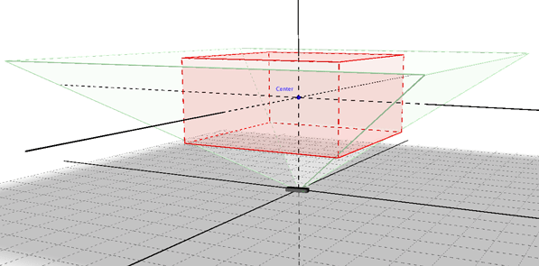
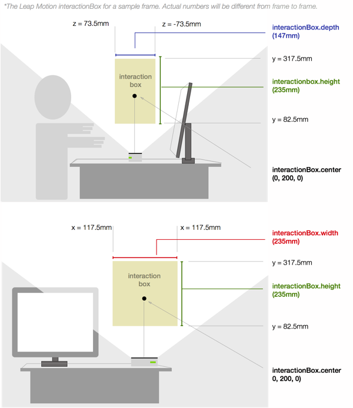
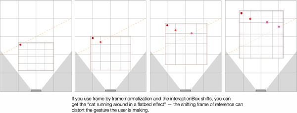

# 坐标系统

在一个应用中使用 LeapMotion 控制器的一个基本任务就是将受到的坐标系统的值映射到应用所定义的合适的坐标系统中。

## LeapMotion 坐标系

LeapMotion 控制器提供了精确到毫米级的坐标值。因此，如果一根手指指尖的坐标给定为`(x, y, z) = [100, 100, -100]`，那么这些值均已毫米为单位，即 `x=+10cm, y=+10cm, z=-10cm`。

LeapMotion 控制器硬件本身就是帧参考的中心。其原点位于硬件的顶部的中心。因此，如果你触摸到 LeapMotion 控制器的中央，那么你指尖的坐标应该是`[0,0,0]`。


*LeapMotion 控制器使用右手系*

在标准位置下，用户通常坐在桌子的前方，这时为 LeapMotion 控制器的 +z 轴，而电脑本身则位于 LeapMotion 的 -z 轴。当控制器放置的位置反向时，LeapMotion 软件还会调整坐标系统（绿色 LED 灯总是朝向用户的）。但是，当用户朝向控制器的其他方向时，LeapMotion 软件则不会检测这种状态。

你的应用程序应设计引导用户不要太靠近 LeapMotion 控制器；当手悬浮于控制器的正上方时，则会挡住大部分的视野。

## 变换坐标系到你的应用中

为使用 LeapMotion 设备的相关信息，你必须解析这些数据让他们在你的应用中变得有意义。例如，映射 LeapMotion 坐标系统到应用的坐标系统中，你必须确定到底使用哪个坐标轴、多大的视野最好以及到底是使用绝对映射还是相对映射。

对于 3D 应用而言，使用三个坐标轴会更有意义。而对于2D 应用而言，你通常会丢弃一个轴（一般情况下是 z 轴），并映射其它的两个轴到你的应用坐标中。

无论你使用的是两个还是三个轴，你必须确定你的应用要使用多大的 LeapMotion 视野。这个视野是一个倒立的金字塔。可用的范围在接近 x 轴和 z 轴底部角落时时会变得非常小。

注意，当你尝试接触底部角落时，你的手指会穿过设备的视野，并且你不能够将指针移出视野外。

你还需要确定变换坐标系的比例（例如，在2D 应用中每毫米对应多少像素）。较大的缩放因子越能够影响小的物理移动。这就使得我们能更加简单的移动鼠标指针，例如从应用的一段到另一端，不过也会使得精度不够。所以你需要在移动速度和精度之间寻找一个平衡点。

最后，区分不同坐标系统可能需要一个或三个轴。例如，大部分2D窗口绘制 API 认为坐标原点在窗口的左上角，所以 y 轴值是向下增长的。但是 LeapMotion 里 y 轴的值是向下增长的，所以实际上你必须翻转 y 轴进行变换。另一个例子是，Unity3D 游戏开发的系统使用的是左手坐标系，然而 LeapMotion 则使用的是右手坐标系。

## 交互盒子

`InteractionBox`定义了一个LeapMotion 事业中由直线围绕的区域。


和用户的手或手指停留在盒子的时间一样，它会持续停留在 LeapMotion 的视野中。你可以使用这个来确保你的应用的交互盒子能够映射到整个 LeapMotion 视野中。`InteractionBox`类提供了`normalize_point()`方法进行 LeapMotion 坐标系统到你应用坐标系统的转换（归一为[0,1]内）。



`InteractionBox`的大小由 LeapMotion 视野和用户交互高度（在 LeapMotion 控制面板中）决定。控制器软件根据高度保证底部边角依然位于视野内，从而调整盒子的大小。如果你设置的交互高度太高，那么盒子就会变得很大。用户可以基于他们想要的高度来设置交互高度，比如一些用户希望他们的手可以在设备更高的位置进行交互。通过使用 `InteractionBox` 映射坐标系统，你可以让你的应用适用于所有的用户。用户也能将交互的高度设置为自适应。如果用户的手比当前交互盒子的底端还要低，那么控制器软件就会自动降低交互盒子的底部（直到其达到高度的最小值）；同样的，如果用户移动到盒子的上方，那么控制器也会提升盒子的高度。

你可以使用夹紧控制在你使用 `normalize_point()`方法时观察夹紧坐标的效果。如果你没有夹紧，那么你可以获取那些小于零或大于一的值。

因为交互盒子可以随时间的变化而变化，所以要注意，如果你使用另一帧中交互盒子进行归一时，某一帧中所测得的点的归一坐标可能不能匹配到归一后的坐标系中。



为保证一组点的归一结果一直处于追踪帧中，你可以保存一个 InteractionBox 对象——这包括理想情况下的最大高度、宽度、深度以及规范化后的所有点。

映射坐标系其实更将是把温度从摄氏度变为华氏度，想象一下，每个坐标轴的起点（冻结）与终点（沸腾）：


那么你可以用下面的公司进行转换：

```latex
x_{app} = (x_{leap}-Leap_{start})\frac{Leap_{range}}{App_{range}}+App_{start}
```


其中：

```latex
Leap_{range} = Leap_{end} - Leap_{start}
App_{range} = App_{end} - App_{start}
```

通过改变起点和终点，你就可以改变坐标映射来移动覆盖一个更大或更小的区域了。

一个转换坐标的一般化的方法是首先将 LeapMotion 坐标系统归一到零至一范围内，然后将这个归一化的结果转换到你想要的一个范围。实际上，`InteractionBox`类会为你执行归一。

## 变换交互盒子与坐标系

使用交互盒子的第一步，就是将坐标点进行归一，然后在转换归一后的坐标系到你应用的坐标系统下。归一化将点变换到交互区域[0,1]范围内，并将坐标原点移动至底部、左边、后面。如果必要的话，你还可以通过每个轴的最大范围叠加、平移和反向坐标然后归一坐标。

## 2D 变换

作为示例，大部分的 2D 绘制坐标系将原点设置为窗口的左上方，并且自然的不使用 z 轴。所以你可以使用下面的代码将 LeapMotion 的坐标转换为一个 2D 系统：

```python
app_width = 800
app_height = 600

pointable = frame.pointables.frontmost
if pointable.is_valid:
    iBox = frame.interaction_box
    leapPoint = pointable.stabilized_tip_position
    normalizedPoint = iBox.normalize_point(leapPoint, False)
    
    app_x = normalizedPoint.x * app_width
    app_y = (1 - normalizedPoint.y) * app_height
    #The z-coordinate is not used
```

## 3D 变换

将坐标映射到另一个3D 坐标系统时，无论原点如何平移、无论目标坐标系是左手坐标系还是右手坐标系，你都必须知道缩放因子。

```python
def leap_to_world(self, leap_point, iBox):
    leap_point.z *= -1.0; #right-hand to left-hand rule
    normalized = iBox.normalize_point(leap_point, False)
    normalized = normalized + Leap.Vector(0.5, 0, 0.5); #recenter origin
    return normalized * 100.0; #scale
```

## 以不同的方式映射左右手

如果你的应用允许全屏交互，它可以是一个很好的注意来抵消以不同方式作为每个手的归一化坐标原点。通过移动左手的原点到右边和右手的原点到左边，本质上是将每个手的休息位置居中。这则会使当左手尝试去接触右侧角落时会很无聊，反过来也一样。

为对每个手的原点进行平移，使用 `Hand.is_left` 可以先确定手的左右，然后再进行标准的坐标转换。

```python
def differential_normalizer(self, leap_point, iBox, is_left, clamp):
    normalized = iBox.normalize_point(leap_point, False)
    offset = 0.25 if is_left else -0.25
    normalized.x = normalized.x + offset

    #clamp after offsetting
    normalized.x = 0 if (clamp and normalized.x < 0) else normalized.x
    normalized.x = 1 if (clamp and normalized.x > 1) else normalized.x
    normalized.y = 0 if (clamp and normalized.y < 0) else normalized.y
    normalized.y = 1 if (clamp and normalized.y > 1) else normalized.y

    return normalized
```

注意，在这种技术下你必须设置`clamp`参数为 false。（如果你想，那么你应该手动设置 x 轴的补偿偏置。）

## 提高灵敏度

将整个交互盒子的范围映射为你应用程序的交互区域并不总是最好的选择。你可能会希望在现实中的一个较小的移动就能实现你应用中较大的变化，你可以简单的不需要归一的变换 LeapMotion 的坐标系统（参考上节）。但是如果你依然想要其他的交互盒子的好处，你可以变换并通过一个因子来归一这些坐标。不同的因子会给出运动不同的灵敏度。如果你的灵敏度太高，那么你的交互可能很难控制。

你也可以反着来，比如乘以一个小于1的值，但是这并没有什么意义，因为根据定义，用户的运动不会覆盖你应用的整个区域。相反，将你应用的交互区域设置小一些会更简单且有效。

下面的例子给出了适应二维让移动变成 1.5 背的灵敏度：

```
app_width = 800
app_height = 600

pointable = frame.pointables.frontmost
if pointable.is_valid:
    iBox = frame.interaction_box
    leapPoint = pointable.stabilized_tip_position
    normalized_point = iBox.normalize_point(leapPoint, False)
    
    normalized_point *= 1.5; #scale
    normalized_point -= Leap.Vector(.25, .25, .25); # re-center

    app_x = normalized_point.x * app_width
    app_y = (1 - normalized_point.y) * app_height
    #The z-coordinate is not used
```
你应注意到，即使将`clamp`参数设为 true 也不会保留你定义边界中的最终坐标。用户的动作应该能够简单的移除你应用的交互区域，记住，提供一个有效的视觉反馈给用户是很有帮助的。 