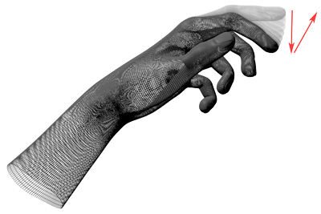

# 手势

LeapMotion 软件识别特定的运动模式作为手势，能够表示为用户的意图或指令。LeapMotion 软件提供了一帧当中的手势检测，并以相同的方式检测手指和手。对每个观察到的手势，LeapMotion 软件会将其添加一个 Gesture 对象到 Frame 中。你可以通过 Frame 的手势列表中获得这些 Gesture 对象。

Gesture 为 LeapMotion 追踪数据提供了一个比直接观察移动手指或运动的高层的抽象处理。注意，LeapMotion API 中的手势依然是一个比你期望用在程序从的手势级别更低手势数据。手势不能够通过事件进行通知，而是在手势的生命周期中将离散的手势对象添加到每一帧当中。

下面的移动模式能够被 LeapMotion 的软件识别：

* Circle -  画圈，一个手指在空中画圈
* Swipe - 滑动，一个手指长的、线性的移动
* Key Tap - 键式点按，像按一个键盘按键一样的点按移动
* Scree Tap - 屏幕点按，想点击一个屏幕一样的垂直于电脑屏幕的移动

当 LeapMotion 软件首次对一个移动模式分类为手势时，一个 Gesture 对象会被添加到帧中。如果手势继续保持，那么 LeapMotion 会更新随后帧中的 Gesture 对象。Gesture 对象涉及相同的移动时会共享相同的 ID 值。

画圈和滑动手势都是持续的。LeapMotion 软件会在每一帧中更新这些对象。点按手势都是彼此不相关的。LeapMotion 软件会提供每一个单独的点按的 Gesture 对象

**重要**：在在应用使用手势之前，你必须对每个你想要识别的手势进行启用。Controller 类使用 enableGesture() 方法来是你能够启用不同的手势类型。

## 画圈

*食指的画圈手势*

你可以对任何手指或工具使用画圈手势，画圈手势是连续的，一旦手势开始，LeapMotion 软件会更新这个过程直到手势结束。这个画圈手势会在画圈的手指或工具远离所在圆圈或移动过慢时停止。

参考 [`CircleGesture`](../api/Leap.CircleGesture.md) 查看更多信息。

## 滑动
LeapMotion 软件会识别一个手指的线性移动作为滑动手势。

*水平方向上的滑动手势*

你可以对任何手指在任何方向上启用滑动手指。滑动手势是连续的。一旦手势开始，LeapMotion 软件会更新这个过程直到手势结束。这个滑动手势会在手指方向改变或移动过慢时停止。

参考 [`SwipeGesture`](../api/Leap.SwipeGesture.md) 查看更多信息。

## 点按

LeapMotion 软件能识别两种类型的点按：键式点按和屏幕点按。

### 键式点按

*食指的键式点按手势*

你可以像按键一样执行一个键式手势。点按手势是离散的。每次添加的点按手势只有一个 Gesture 对象。

参考 [`KeyTapGesture`](../api/Leap. KeyTapGesture.md) 查看更多信息。

### 屏幕点按

*食指的键式点按手势*

你可以像点击屏幕一样执行一个屏幕点按手势。点按手势是离散的。每次添加的点按手势只有一个 Gesture 对象。

参考 [`ScreenTapGesture`](../api/Leap.ScreenTapGesture.md) 查看更多信息。