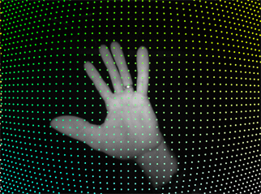
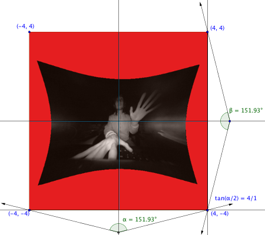
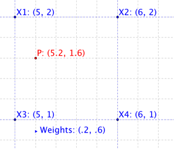
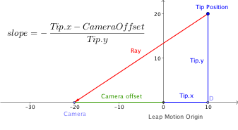

#  相机图像

LeapMotion 控制器使用红外追踪传感器。你可以使用`Controller.images`或`Frame.images`函数来访问相机的图像。这些函数提供了一个`ImageList`对象，包含了`Image`对象。`Controller.images`提供了最近的图像集。`Frame.images`则提供了分析后的图片而不是直接由`Controller`返回的图片。


*来自一个摄像头的图像。网格高亮了显著的复杂的图像镜头畸变失真。*

图像可以用于：

* 头戴式显示器视频输出
* 增强现实
* 计算机视觉

图像 API 提供了包含亮度值和标定地图的缓存，这使得我们可以校准由于镜头畸变导致的光学图像失真。

## 基本图像 API

可以从`Controller.images`或`Frame.images`两者中的任何一个获取 `ImageList` 对象。`Controller.images`函数能够给出最近的图像数据。`Frame.images`给出了图像和其关联的帧。从因为处理帧需要一些时间，所以帧中图像将比控制器至少延后一帧（在未来的版本中，数据帧速率可能被从相机帧率中降低，因此这个差距可能会进一步增大）。从控制器中获得的图像有最小的延迟，但也不会完全匹配当前处理帧的数据。当使用 Controller.images 时，你可以在 Listener 对象中实现 on_images()回调。你的 Listener.on_images()会在控制器一准备好新图像的时候就调用。

图像上数据作为像素值的数组来提供。这个数据的格式由 Image.format 的值表示。目前，只有一个格式。「INFRARED」格式在每个像素上使用一个字节，定义了传感器位置所测量像素的亮度值。你可以将这个红外格式的数据显示为灰度数据。未来的 LeapMotion 硬件可能会提供不同的传感器图像数据格式。

## 图像失真

当光射线进入 LeapMotion 相机时，镜头会弯曲这些射线以保证其落在传感器上，这记录了每个特定像素的灰度值。当然，没有镜头是完美的，所以光射线也可能不会落在传感器而导致出现一些污点。而校准图则提供了对这种不完美数据的校准，根据这个图你能够计算出原始的光线角度。你可以使用校正后的角度来生生成为失真的图像，然后对两个角度的图像进行立体配对，然后你就可以识别图像中的 3D 位置了。注意，矫正图只矫正了镜头畸变而没有矫正透视畸变。

对于图像矫正，失真数据能够提供给着色器，然后有效的插入更实用的光线。而为一小部分点获取正确的角度，你可以使用 Image.warp()函数（但是这不能在高帧率下高效的转换一个完整的位图）。

失真数据是由 LeapMotion 相机的视野造成的。Image 类提供了`Image.ray_scale_x`和`Image.ray_scale_y`来成比例的查看角度并保证失真图能够转换到整个视野中，当前的 LeapMotion 外围大约是150度。一个150度角的视野意味着光线会穿过镜头后最大会倾斜4/1。


*150度角的视野会倾斜±4左右（75度的正切大约为4）*

图中展示了失真到矫正的图像数据重构。每个像素的亮度值都是从从一个特定方向进入相机的光线强度。图像使用校准图，根据水平和垂直倾斜来描绘每个像素并据此寻找真正的亮度值。图中红色的部分表示了对没有亮度值的区域进行填充（实际视野小于150度）。


## 图像方向

图像的顶部总是朝向 LeapMotion 坐标系的 z 轴的负方向。默认情况下，LeapMotion 软件会自动调整坐标系使得手会从 z 轴的正方向进入（用户也能在控制面板中取消自动定向）。在手插入视野之前，是不可能知道图像的朝向的，因为从不知道用户是怎样放置或挂在 LeapMotion 设备的。如果用户将设备放置为和你想象的方向相反，那么图像将会倒置直到他们把双手放到视图中(或者旋转设备本身)。

## 获取原始图像

在获取图像数据之前，你必须使用`Controller.set_policy()`函数设置`POLICY_IMAGES`标志。处于隐私考虑，每个用户必须在 LeapMotion 控制面板中启用这个特性后每个应用才能获取这些图像的原始数据。

为获取这些原始数据，你可以使用`Controller.images`或`Frame.images`中的任何一个。从 LeapMotion 外围有两颗摄像头开始，这个函数会返回一个包含两个图片的`ImageList`对象（如果同时可以激活多个 LeapMotion 设备，那么这在未来可能会进行修改）。图像索引为0时表示左边的相机图像；1则表示为右边相机。注意外围的左右方向能够被自动检测，通过检测用户向视野中插入手的方向进行判定。方向通过控制面板中的自动定向追踪来激活。

一旦你拥有了`Image`对象，你可以从数据缓存中获取8位亮度值。这个缓存的长度是`Image.width`乘以`Image.height`乘以`Image.bytes_per_pixel`。长和款会根据当前控制器的操作模式进行改变。注意在『鲁棒模式』下，图像会变成一半高度。

## 获取标定图

由于镜头的弯曲和其他的一些缺陷，标定图可以被用于矫正图像失真。这个图是一个64x64的网格点。每个点包括两个32位值，因此缓存的大小是128乘64乘4。你可以使用 `Image.distortion` 来获取标定图的缓存。

在缓冲器每个点指示查找为在原始图像中的对应像素的校正的亮度值。有效坐标归在区间[0,1]。校准地图的各个元素可具有在范围[-0.6,2.3]的值，但低于零坐标或上述1无效。使用校准数据时丢弃范围[0,1]之外的数值。

转换像素坐标可以乘以图像的宽度或者高度。对于处在校准网格点之间的像素，可以在最近的网格点之间插入。在相机镜头有一个非常大的视角（大约150度），对应的也就有大量的失真。正因如此，不是在校准网格的每个点映射到有效像素。下面渲染显示了镜头校正数据作为颜色值。左边的图像显示x值;右侧示出的y值。


*红色值表明落在图像外的映射值*

校准地图的大小可能在将来改变，所以`Image`类通过 `distortion_width` 和 `distortion_height` 函数提供了网格尺寸（实际上用两倍的宽度来解释每格点两个值）。包含校准数据的缓冲区的长度是 `distortion_width` 乘以 `distortion_height` 乘以 4字节。


## 图像光线矫正

你可以用以下两种方法来矫正原始图像的失真：

* 使用 `Image.warp()` 和 `Image.rectify()` 函数
* 在 `Image.distortion` 缓存中直接使用数据。

`warp()` 和 `rectify()` 函数更加简单，但是他们独立处理每个像素的时间相对会更长。如果你只是矫正一些少量的点、或者不是实时处理这些数据、亦或者你不能使用 GPU 着色器时，那么你可以使用这些函数。失真缓存被设计为在包子应用程序帧率良好的状态下，使用用于 GPU 着色程序，矫正整个原始图像。

## 使用 Image.warp() 矫正

`Image.warp()` 接受一射线方向上的像素坐标，并且返回到原始图像数据的射线方向上指定记录亮度。

## 使用着色器矫正

一个更有效的方法来更正整个图像就是使用 GPU 矫正程序。传递图像数据给一个碎片着色器作为普通材质，而失真数据则作为编码材质。你可以标记块状材质，通过使用正确的材质亮度值来编码失真数据。

TODO: 示例代码

## 在 32位 ARGB 纹理中编码数据失真

如果每像素32位的纹理格式并不是你目标平台上可用的，那么你可以对 x 和 y 单独分离其纹理来查找值并编码到多个八位颜色组件。然后你必须在解码之前查找原始的亮度值。

一种用于在纹理浮点编码数据的常用方法是将输入值分解成四个较低精度值，然后在着色器恢复它们。例如，你可以编码一个浮点数到有4个8位组成部分如下一个Color对象：

```
Color encodeFloatRGBA(float input)
{
    input = (input + 0.6)/2.3; //scale the input value to the range [0..1]
    float r = input;
    float g = input * 255;
    float b = input * 255 * 255;
    float a = input * 255 * 255 * 255;

    r = r - (float)Math.floor(r);
    g = g - (float)Math.floor(g);
    b = b - (float)Math.floor(b);
    a = a - (float)Math.floor(a);

    return Color(r, g, b, a);
}
```

要重构在片段着色器的值，你需要查找在纹理的值并执行相互操作。为了避免丢失太多精度，需要对 x 和 y 失真值在分开编码纹理。一旦失真指数从纹理采样，并进行解码，你就可以查找从相机图像的纹理正确的亮度值。

```
uniform sampler2D texture;
uniform sampler2D vDistortion;
uniform sampler2D hDistortion;

varying vec2 distortionLookup;
varying vec4 vertColor;
varying vec4 vertTexCoord;

const vec4 decoderCoefficients = vec4(1.0, 1.0/255.0, 1.0/(255.0*255.0), 1.0/(255.0*255.0*255.0));

void main() {
  vec4 vEncoded = texture2D(vDistortion, vertTexCoord.st);
  vec4 hEncoded = texture2D(hDistortion, vertTexCoord.st);
  float vIndex = dot(vEncoded, decoderCoefficients) * 2.3 - 0.6;
  float hIndex = dot(hEncoded, decoderCoefficients) * 2.3 - 0.6;

  if(vIndex >= 0.0 && vIndex <= 1.0
        && hIndex >= 0.0 && hIndex <= 1.0)
  {
      gl_FragColor = texture2D(texture, vec2(hIndex, vIndex)) * vertColor;
  } else {
      gl_FragColor = vec4(1.0, 0, 0, 1.0); //show invalid pixels as red
  }
}
```

## 使用双线性插值矫正

在着色器不可用的情况下你能够使用比 warp()函数更快的双线性差值纠正图像失真。（对于任何优化，你都应该验证你的结果并进行性能测试。）

回忆一个 64x64 的网格图元素，想象这些图像的网格元素（包括元素[0,0]在较低的左手，以及[64,64]为较高的右手）。每个元素包含一个水平坐标和一个垂直坐标从而识别传感器图像数据的位置，从而寻找记录每个像素目标的亮度值。为了找到在像素和失真网格元素之间的亮度值，你必须在这些网格点当中插入一些值。



下面的算法是对目标图像上给定的像素进行失真矫正的步骤：

1. 寻找校准点周伟的四个目标像素；
2. 根据目标周伟网格之间的距离来计算插值；
3. 寻找网格元素的水平坐标和垂直坐标；
4. 对水平坐标进行双线性插值；
5. 对垂直坐标进行双线性插值；
6. 丢弃所有在[0,1]范围外的点，这些位置没有数据；
7. 对这些值进行反向归一；
8. 找到计算像素坐标的传感器值；
9. 将亮度值设置到原始坐标目标图像上。

循环的在每个图像中进行双线性插值对于 Python 来说很慢，相反，你可以使用 OpenCV 中提供的函数进行插值。首先你需要用`cv2.remap()`函数对格式进行转换。

```python
import cv2, Leap, math, ctypes
import numpy as np

def convert_distortion_maps(image):

    distortion_length = image.distortion_width * image.distortion_height
    xmap = np.zeros(distortion_length/2, dtype=np.float32)
    ymap = np.zeros(distortion_length/2, dtype=np.float32)

    for i in range(0, distortion_length, 2):
        xmap[distortion_length/2 - i/2 - 1] = image.distortion[i] * image.width
        ymap[distortion_length/2 - i/2 - 1] = image.distortion[i + 1] * image.height

    xmap = np.reshape(xmap, (image.distortion_height, image.distortion_width/2))
    ymap = np.reshape(ymap, (image.distortion_height, image.distortion_width/2))

    #调整失真映射到目标图像大小
    resized_xmap = cv2.resize(xmap,
                              (image.width, image.height),
                              0, 0,
                              cv2.INTER_LINEAR)
    resized_ymap = cv2.resize(ymap,
                              (image.width, image.height),
                              0, 0,
                              cv2.INTER_LINEAR)

    #使用更快的标定点映射
    coordinate_map, interpolation_coefficients = cv2.convertMaps(resized_xmap,
                                                                 resized_ymap,
                                                                 cv2.CV_32FC1,
                                                                 nninterpolation = False)

    return coordinate_map, interpolation_coefficients
```

然后将符合的图像传递给`cv.remap()`函数：

```python
def undistort(image, coordinate_map, coefficient_map, width, height):
    destination = np.empty((width, height), dtype = np.ubyte)

    # 将图像数据封装到 numpy 数组
    i_address = int(image.data_pointer)
    ctype_array_def = ctypes.c_ubyte * image.height * image.width
    # 转换为 ctypes 数组
    as_ctype_array = ctype_array_def.from_address(i_address)
    # 转换为 numpy 数组
    as_numpy_array = np.ctypeslib.as_array(as_ctype_array)
    img = np.reshape(as_numpy_array, (image.height, image.width))

    # 重绘到目标图像
    destination = cv2.remap(img,
                            coordinate_map,
                            coefficient_map,
                            interpolation = cv2.INTER_LINEAR)

    # 重绘输出到目标大小
    destination = cv2.resize(destination,
                             (width, height),
                             0, 0,
                             cv2.INTER_LINEAR)
    return destination
```

注意：你应该避免对每个帧的失真图进行转换。他们只会在不同的设备插入时，图像的方向才会翻转方向（当手正将进入时），要么设备就会重进校准。下面的代码值对失真图进行了一次转换（没有处理当失真图可以转换的情况）：

```python
def run(controller):
    maps_initialized = False
    while(True):
        frame = controller.frame()
        image = frame.images[0]
        if image.is_valid:
            if not maps_initialized:
                left_coordinates, left_coefficients = convert_distortion_maps(frame.images[0])
                right_coordinates, right_coefficients = convert_distortion_maps(frame.images[1])
                maps_initialized = True

            undistorted_left = undistort(image, left_coordinates, left_coefficients, 400, 400)
            undistorted_right = undistort(image, right_coordinates, right_coefficients, 400, 400)

            #display images
            cv2.imshow('Left Camera', undistorted_left)
            cv2.imshow('Right Camera', undistorted_right)

            if cv2.waitKey(1) & 0xFF == ord('q'):
                break

def main():
    controller = Leap.Controller()
    controller.set_policy_flags(Leap.Controller.POLICY_IMAGES)
    try:
        run(controller)
    except KeyboardInterrupt:
        sys.exit(0)
        
if __name__ == '__main__':
    main()
```

## 在图像上绘制追踪数据

表示 LeapMotion 的追踪数据非常容易表示。如果你将原始图像数据绘制为位图，那么你使用 `warp()` 函数可以找到对应像素在 LeapMotion 中的位置。

将 LeapMotion 坐标系的一个位置转换到水平和垂直斜面上（从相机角度来看）需要知道相机距离 LeapMotion 坐标系原点有多远。对当前的外围版本来说，x 轴的偏移量是20mm。相机位于 x 轴上，z 轴则没有偏置。斜率是简单来说就是从相机图像平面与 （x 轴水平斜率）；z 轴垂直斜率除以到图像平面的距离。下面的图展示了水平斜率的几何形式：



*计算展示的是左侧相机，添加偏置距离而不是从右侧相机减去一个值*

一旦你知道了光线斜率值，你可以使用 `warp()` 获取像素的坐标。

注意：偏置对于 LeapMotion 不同形式的因子可能会不同，但目前来说没有办法从 API 中获取这个值。

如果你渲染了正确的图像数据，那么将追踪数据关联到图像上就取决于你如何渲染图像了。对于3D场景来说，使用一致的缩放和材质块来矫正图像都是没有关系的。而对于其他类型的渲染来说，你必须转换光线的倾斜程度来表示 LeapMotion 中目标在像素中的位置从而进行图像矫正。

## 计算图像特征的方向

获取图像的方向特征可以使用`Image.rectify()`函数。这个函数返回的向量包含了一个水平和垂直斜面（从相机角度定义）给定了原始图像数据的像素坐标。

如果你可以在足够的精度下识别两副图像下相同的特征，那么你还可以使用两个相机的倾斜值测量 3D 位置。

## 头戴式显示器模式

LeapMotion 服务/守护进程为 LeapMotion 安置在头戴式显示器时提供了追踪优化。在这个模式中，LeapMotion 软件会希望从上方而不是下方查看手。当存在手掌的朝向总是朝向 LeapMotion 本身的歧义时，软件会重新初始化手的模型进行修正。因此这个模式更适合在 LeapMotion 设备位于头戴式显示器时使用。

开启这个模式可以激活 HMD 策略：

```
controller.set_policy(Leap.Controller.POLICY_OPTIMIZE_HMD);
```

这个策略在不可能被挂载在 HMD 时会被拒绝，例如被嵌入在笔记本或键盘里的设备。
