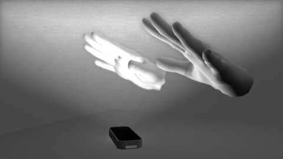
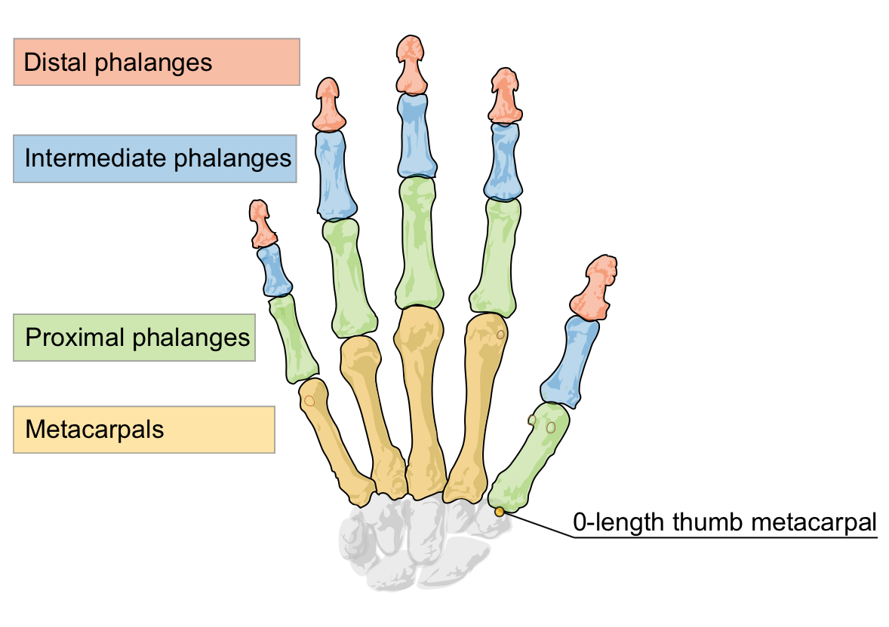
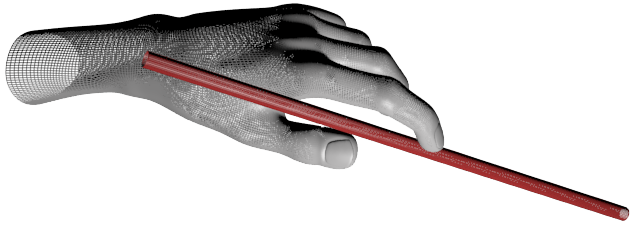
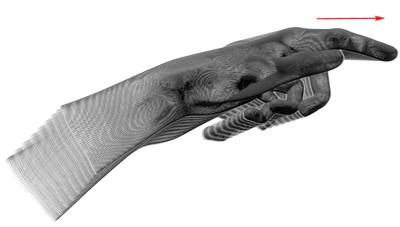

# API 综述

LeapMotion 是一种检测和跟踪手、手指及类似手指物品的工具。设备会对近距离的手或者手指进行高帧率高精度的跟踪，并提供离散的位置、手势及动作信息。

<!--The Leap Motion system recognizes and tracks hands, fingers and finger-like tools. The device operates in an intimate proximity with high precision and tracking frame rate and reports discrete positions, gestures, and motion.-->

LeapMotion 控制器使用光学传感器和红外线。Leap可以检测当控制器处于标准操作位置时，沿 Y 轴向上处于控制器位置大约 150 度的视野。LeapMotion 的有效范围在处于设备上方时从大约 25 毫米到 600 毫米不等。

<!--The Leap Motion controller uses optical sensors and infrared light. The sensors are directed along the y-axis – upward when the controller is in its standard operating position – and have a field of view of about 150 degrees. The effective range of the Leap Motion Controller extends from approximately 25 to 600 millimeters above the device (1 inch to 2 feet).-->

当被追踪物体具有清晰、高对比度的轮廓时，传感器的检测和追踪能达到最佳工作状态。LeapMotion 软件结合传感器数据和其内建的人手模型来解决检测和追踪时的问题。

<!--Detection and tracking work best when the controller has a clear, high-contrast view of an object’s silhouette. The Leap Motion software combines its sensor data with an internal model of the human hand to help cope with challenging tracking conditions.-->

## 坐标系
LeapMotion 使用一个右手笛卡尔坐标系，它的原点位于 LeapMotion 控制器的顶面中心点，X 轴与 Z 轴位于水平面，其中 X 轴与控制器的长边平行。Y轴垂直向上为正方向（这与绝大多数计算机图形系统的坐标轴是相反的，它们的正方向向下）。Z 轴的方向指向用户所处的位置。

<!--The Leap Motion system employs a right-handed Cartesian coordinate system. The origin is centered at the top of the Leap Motion Controller. The x- and z-axes lie in the horizontal plane, with the x-axis running parallel to the long edge of the device. The y-axis is vertical, with positive values increasing upwards (in contrast to the downward orientation of most computer graphics coordinate systems). The z-axis has positive values increasing toward the user.-->

LeapMotion API 测量的物理量如下：

* 距离 - 毫米
* 时间 - 微秒（除非有特别说明）
* 速度 - 毫米/秒
* 角度 - 弧度

<!--The Leap Motion API measures physical quantities with the following units:

Distance:	millimeters
Time:	microseconds (unless otherwise noted)
Speed:	millimeters/second
Angle:	radians-->

## 动作追踪数据

当 LeapMotion 控制器在视野范围内追踪内追踪手、手指和工具时，它以帧为单位更新一套数据。每个 [**Frame**](../api/Leap.Frame.md) 对象代表一帧，其中包含检测的实体序列，比如手、手指、工具以及识别到的手势和描述场景中整体动作的因素。`Frame` 对象是 LeapMotion 数据模型的基础。

<!--As the Leap Motion controller tracks hands, fingers, and tools in its field of view, it provides updates as a set – or frame – of data. Each Frame object representing a frame contains lists of tracked entities, such as hands, fingers, and tools, as well as recognized gestures and factors describing the overall motion in the scene. The Frame object is essentially the root of the Leap Motion data model.-->

更多关于 `Frames` 的内容，请参考：[*Frames*](../api/Leap.Frame.md)

<!--To read more about Frames, see Frames.-->

### 手部
手模型提供了手部的各种信息，包括手的识别、位置及其他特征的检测，手部所连接手臂，以及手上的手指序列。

<!--The hand model provides information about the identity, position, and other characteristics of a detected hand, the arm to which the hand is attached, and lists of the fingers associated with the hand.-->

请参考 [Hand](../api/Leap.Hand.md) 类。

<!--Hands are represented by the Hand class.-->

LeapMotion 软件使用人的手部模型来提供可预测的追踪，即便当手仅仅只是部分可见时。手模型始终会给出五个手指的位置，但是只有在手和手指的轮廓是清晰可见时才能达到最佳效果。软件利用了手的可见部分、它的内建模型以及历史观测信息来计算不可见部分最有可能的位置信息。值得一提的是，手指的细微动作对于 LeapMotion 传感器来说可能不太能够被检测到。[Hand.confidence](../api/Leap.Hand.md) 用于指示观测数据与内建模型的吻合度。

<!--The Leap Motion software uses an internal model of a human hand to provide predictive tracking even when parts of a hand are not visible. The hand model always provides positions for five fingers, although tracking is optimal when the silhouette of a hand and all its fingers are clearly visible. The software uses the visible parts of the hand, its internal model, and past observations to calculate the most likely positions of the parts that are not currently visible. Note that subtle movements of fingers tucked against the hand or shielded from the Leap Motion sensors are typically not detectable. A Hand.confidence rating indicates how well the observed data fits the internal model.-->

当每帧中存在不只一人的手或者类似手的物体时，手序列也可以出现超过两只手的对象，然而为了达到最佳的追踪效果，我们建议最多只让两只手出现在视野内比较合适。

<!--More than two hands can appear in the hand list for a frame if more than one person’s hands or other hand-like objects are in view. However, we recommend keeping at most two hands in the Leap Motion Controller’s field of view for optimal motion tracking quality.-->

### 手臂
手臂（[Arm](../api/Leap.Arm.md)）是骨骼类似物对象，它包括其指向、长度、宽度、手臂的端点。当肘部不在视野中时，LeapMotion 控制器会基于历史数据及人体参数来估计它出现的位置。

<!--An Arm is a bone-like object that provides the orientation, length, width, and end points of an arm. When the elbow is not in view, the Leap Motion controller estimates its position based on past observations as well as typical human proportion.-->

### 手指
LeapMotion 控制器可以给出一只手上每一根手指的数据。如果某个手指的部分或者全部不可见，那么这根手指的特性同样会基于历史数据进行估计。手指通过名字来进行标识，即：`thumb`(大拇指)，`index`(食指)，`middle`(中指)，`ring`(无名指) 以及 `pinky`(小拇指)。

<!--The Leap Motion controller provides information about each finger on a hand. If all or part of a finger is not visible, the finger characteristics are estimated based on recent observations and the anatomical model of the hand. Fingers are identified by type name, i.e. thumb, index, middle, ring, and pinky.-->

手指利用 [**Finger**](../api/Leap.Finger.md) 类对象进行刻画，是一种 [**Pointable**](../api/Leap.Pointable.md)(可指向) 对象。

<!--Fingers are represented by the Finger class, which is a kind of Pointable object.-->

一个 Finger 对象包含了一个 Bone 对象，用于描述每个手指上的每个解剖学上的骨头位置和指向。

<!--A Finger object provides a Bone object describing the position and orientation of each anatomical finger bone. All fingers contain four bones ordered from base to tip.-->

骨头分别是：

* Metacarpal 
  – the bone inside the hand connecting the finger to the wrist (except the thumb)
* Proximal Phalanx 
  – the bone at the base of the finger, connected to the palm
* Intermediate Phalanx 
  – the middle bone of the finger, between the tip and the base
* Distal Phalanx 
  – the terminal bone at the end of the finger
  
这个模型中的大拇指和标准解剖模型的命名不同。真实的大拇指比其他手指少一根骨头。但是为了编程的方便，LeapMotion 模型中的大拇指包含了一个长度为 0 的 Metacarpals，以便大拇指的骨头索引与其他手指相同。这样导致的结果是 在LeapMotion 模型中，大拇指的解剖学 Metacarpal 骨名被标注为 Proximal Phalanx，而解剖学上的 Proximal Phalanx 被标注为 Intermediate Phalanx。

<!--This model for the thumb does not quite match the standard anatomical naming system. A real thumb has one less bone than the other fingers. However, for ease of programming, the Leap Motion thumb model includes a zero-length metacarpal bone so that the thumb has the same number of bones at the same indexes as the other fingers. As a result the thumb’s anatomical metacarpal bone is labeled as a proximal phalanx and the anatomical proximal phalanx is labeled as the intermediate phalanx in the Leap Motion finger bone model.-->

（原始图形见：[Marianna Villareal](https://commons.wikimedia.org/wiki/File:Scheme_human_hand_bones-en.svg)）

<!--(Original diagram by Marianna Villareal.)-->

### 工具
工具是一个类似铅笔的对象。

<!--A tool is an object like a pencil.-->

工具使用 Tool 类进行刻画，也一种[**Pointable**](../api/Leap.Pointable.md)(可指向) 对象。

<!--Tools are represented by the Tool class, which is a kind of Pointable object.-->

只有细且为圆柱体的物体才会被认为是工具。在 v2版本中，工具是与手相互独立的。

<!--Only thin, cylindrical objects are tracked as tools.
Note that as of version 2, tools are independent of hands.-->

### 手势
LeapMotion 软件能够识别特定运动模式的手势来表达用户的意图或者指令。每个手势都能对手指或工具都进行独立观测。LeapMotion 会如同返回其他运动追踪数据（比如手、手指）一样在每一帧里返回手势的检测信息。

<!--The Leap Motion software recognizes certain movement patterns as gestures which could indicate a user intent or command. Gestures are observed for each finger or tool individually. The Leap Motion software reports gestures observed in a frame the in the same way that it reports other motion tracking data like fingers and hands.-->

手势通过 [Gesture](../api/Leap.Gesture.md) 类及其子类 [CircleGesture](../Leap.CircleGesture.md), [KeyTapGesture](../api/Leap.KeyTapGesture.md), [ScreenTapGesture](../api/Leap.ScreenTapGesture.md), [SwipeGesture](../api/Leap.SwipeGesture.md) 进行刻画。

<!--Gestures are represented by the Gesture class and its subclasses, CircleGesture, KeyTapGesture, ScreenTapGesture, and SwipeGesture.-->

下面的运动模式能够被 LeapMotion 软件识别：

<!--The following movement patterns are recognized by the Leap Motion software:-->

 

 

 

**注意**：在你的应用程序中使用手势之前，你必须确保你要用的每一个手势都能够被识别。你需要使用 `Controller` 类中的 `enableGesture()` 方法使你想用的手势被识别到。

<!--Important: before using gestures in your application, you must enable recognition for each gesture you intend to use. The Controller class has an enableGesture() method that you can use to enable recognition for the types of gestures you use.-->

### 动作
用户手部在某一段时间内的变化被定义为基本的动作种类，运动就是根据这些基本的动作种类被估计出来的。运动包括缩放、旋转、位移（位置变化）。

<!--Motions are estimates of the basic types of movements inherent in the change of a user’s hands over a period of time. Motions include scale, rotation, and translation (change in position).-->

运动是在两帧之间被计算出来的。你可以从一个 [**Frame**](../api/Leap.Frame.md) 对象里获得一个场景的全部运动因子。也可以从一个 [**Hand**](../api/Leap.Hand.md) 对象里获得与单独一只手有关的运动因子。

<!--Motions are computed between two frames. You can get the motion factors for the scene as a whole from a Frame object. You can also get factors associated with a single hand from a Hand object.-->

你可以用返回的运动因子来为你的应用设计交互方式。比如，你可以计算两帧之间的缩放因素来让用户改变物体的大小，而不是很多帧的数据来追踪每一个手指的位置变化。

<!--You can use the reported motion factors to design interactions within your application. For example, instead of tracking the change in position of individual fingers across several frames of data, you could use the scale factor computed between two frames to let the user change the size of an object.-->

|**运动类型**|**帧**|**手**|
|:-:|:--|:--|
|Scale(缩放)|帧的缩放反映了场景物体之间的靠近或远离的运动|手的缩放则反应了手指的开合变化。|
|Rotation(旋转)|帧的旋转反映了场景内物体的运动差异。例如一只手抬起而另一只则放下|手的旋转反应了一只手朝向的变化情况。|
|Translation(平移)|帧的平移反映了场景内所有物体的平均位置变化。比如两只手都同时向左、上、前方移动。|手的平移反应了手的位置变化。|

### 传感器图像

<!-- Sensor Images -->

获得追踪数据的同事你也能够获取 LeapMotion 摄像头所拍摄到的原始图像。

<!--Along with the computed tracking data, you can get the raw sensor images from the Leap Motion cameras.-->

图像数据包括测量的 IR 亮度值和用户修正镜头畸变的校准数据。你可以吧传感器图像用于增强现实，尤其是当 LeapMotion 与 VR 头盔设备进行协作时候。

<!--The image data contains the measured IR brightness values and the calibration data required to correct for the complex lens distortion. You can use the sensor images for augmented reality applications, especially when the Leap Motion hardware is mounted to a VR headset.-->

更多信息请参考：[相机图像](Leap_Images.md)

<!--For more information, see Camera Images.-->