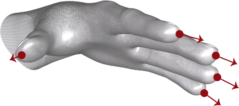

# 手指

手指和工具——是一种可指向的——能够被 `Pointable` 对象表示。此外，单独的 `Finger` 和 `Tool` 类使 `Pointable` 类专门提供一些特定的信息。

## 获取可指向对象
你可以从`Hand`对象中获取关联的手指，也可以从 `Frame` 对象中获取检测到的可指向对象（手指和工具）。

## 可指向对象的特征

可指向对象拥有许多属性来描述需要表述的手指或工具的特性。



`Finger` 类的 `tipPosition` 和 `direction` 向量提供了手指之间的位置和方向。

LeapMotion 软件会对检测到的可指向对象分类为手指或工具。可以使用 `Pointable::isTool()` 函数来判断 Pointable 对象表示的是手指还是工具。


一个 `Tool` 对象比手指更长、更细且更直。

* Tip position - 指尖位置，从 LeapMotion 原点以毫米为单位的瞬间位置
* Tip velocity -  指尖速度，瞬时速度，单位为mm/s
* Stabilized tip position - 指尖稳定位置，利用速度和历史位置进行滤波处理的稳定的指尖位置
* Direction - 方向，当前指向的方向向量
* Length - 长度，手指或工具的长度
* Width - 宽度，平均宽度 
* Touch distance - 触摸距离，从虚拟平面引出的标准化距离，见[触摸仿真](../devguide/Leap_Touch_Emulation.md)。
* Touch zone - 触摸区，当前可指向对象和虚拟触摸平面的相关性。

下面的例子展示了如何从一帧中获取一个可指向对象并访问它的基本特征：

```python
pointable = frame.pointables.frontmost
direction = pointable.direction
length = pointable.length
width = pointable.width
stabilizedPosition = pointable.stabilized_tip_position
position = pointable.tip_position
speed = pointable.tip_velocity
touchDistance = pointable.touch_distance
zone = pointable.touch_zone
```

## 将可指向对象转换为手指或工具

将一个 `Pointable` 对象转换为合适的 `Finger` 或 `Tool` 子类，可以使用 `Finger` 或 `Tool` 构造函数（只有少数情况下你需要使用 Leap 类的构造函数）。

```python
if (pointable.is_tool):
    tool = Leap.Tool(pointable)
else:
    finger = Leap.Finger(pointable)
```

## 手指

`Finger` 对象扩展了 `Pointable` 对象用于表示物理手指。一个手指具有类型、方向和一个骨头集合。

从 LeapMotion SDK 2.0开始，五个手指总是表示为一个手中的手指列表。LeapMotion 软件估计手指和骨头的位置，即便追踪不够清晰。因此手指微妙的移动或者在手背后的移动可能不会有反应。

手指能够通过类型来识别，例如 index, thumb, pinky。手指 ID 是基于手的 ID 而分配的。如果一个手的 ID 是『5』，那么手指的 ID 为从50到55有序的表示拇指到小指。

## 可指向对象、手指和工具列表

`PointableList`, `FingerList` 和 `ToolList` 类都有着相同的结构。他们被设计成一个类似向量的数组，并支持迭代器。你不能移除或替代里面的成员对象，但是你可以将这些列表结合成一个新的相同的类型。

迭代器的使用如下：

```python
for hand in handList:
    print hand
```

`PointableList`, `FingerList`, 和 `ToolList` 类定义了一些额外的函数，使用 LeapMotion 坐标系统中他们的相对位置来获取列表的成员。这些函数包括 `leftmost()`, `rightmost()` 和 `frontmost()`。下面的代码段展示了其中几个函数：

```python
farLeft = frame.fingers.leftmost
mostForwardOnHand = frame.hands[0].fingers.frontmost
rightTool = frame.tools.rightmost
```

