# 用户导向与教程设计指南

随着我们向程序引入 LeapMotion 控制器，我们可以让用户更自然的与电脑进行交互。这是我们有史以来第一次让用户有能力通过手和手指在三维空间中移动来进行精细控制。

<!--
With the introduction of the Leap Motion Controller, we’re unlocking a more natural and intuitive way for people to interact with computers. This is the first time ever that users have the power to control an experience with nuanced hand and finger movements in three dimensional space.
-->

虽然消费者可能对运动控制在某些长警察已经有了一个基本的认识（比如 Microsoft Kinect™ 和 Nintendo Wii™），但这个全新的体验能够让他们每天都能操作计算机。即使你对用户进行适当的引导，这种全新的交互方式也需要时间来适应，而且这种全新的交互方式一旦没有获得正确的引导，就可能会使用户在操作的时候感到沮丧和疑惑。

<!--
Yet, while consumers may have had a basic introduction to motion control in some contexts (e.g. Microsoft Kinect™ and the Nintendo Wii™) this is an entirely new experience for them as it relates to their everyday machines. Interacting in this new way can take some getting used to – and ensuring that you give users a proper understanding of exactly how to interact with your software will mean the difference between a magical experience and one that might leave users frustrated or confused.
-->

接下来的内容是几种不同的用来完成这项任务的方法，它可以指导用户，教他们如何在你的应用中完成特定的交互。无论你如何选择，都请确保你的介绍和教程足够简单明了。

<!--
The following are a few different ways to approach the task of guiding users and teaching them specific interactions within your apps. Whichever you choose, make sure your orientations and tutorials are easily accessible from any point in the app.
-->

## 在 LeapMotion 应用商店创建一个好的演示视频

你应用程序的第一个介绍会是一个屏幕截图和视频，用户能够在 LeapMotion 应用商店的详细页中看到它们。我们强烈建议你包含一个演示视频进行表演，而不仅仅局限于演示其基本功能，还应包括一个用户如何在你的应用中执行交互。下面的应用都有视频演示，它能够帮助用户理解游戏的玩法以及 LeapMotion 的交互。

<!--One of the first introductions to your app might be the screen shots and video a user sees on your Leap Motion app store detail page. It is highly recommended that you include a video which shows off, not only the app functionality, but how a user performs the interactions needed for your app. The following apps have video demos that help users understand the game play and Leap Motion interaction.-->

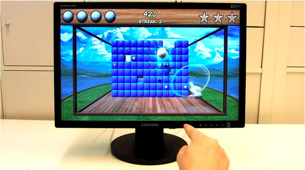
[Watch the BoomBall video](https://apps.leapmotion.com/apps/boom-ball/)

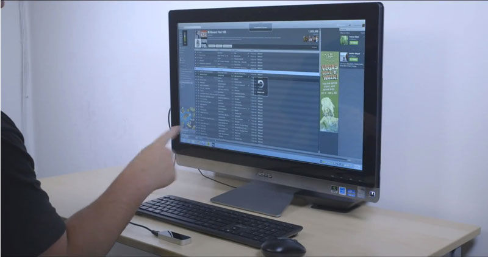
[Watch the HandWAVE video](https://airspace.leapmotion.com/apps/handwave/)

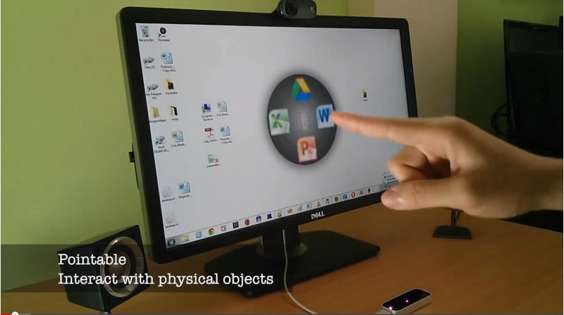
[Watch the Pointables video](https://airspace.leapmotion.com/apps/pointable/windows)

## 交互『关键』
交互的重点在于不同的不同应用的不同场景中的内容（比如开始之前的菜单展示或菜单选项的内容）必须有一致的交互效果。最好能将所有的东西在同一屏幕内显示出来。如果你想做好这一步你应该在草稿上安排你需要的内容和相应的动作。当然如果你的应用操作中加入了一些简单的动画，用户则能更加容易理解每个不同操作之间的区别。

<!--
Interaction ‘Keys’
Interaction Keys are discrete screens (shown either before starting an experience or accessible via a ‘help’ or ‘info’ menu) that outline all of the basic interactions and controls used in an app. It can be great to see everything in one place – but diagrams used need to do a good job of demonstrating both context and action. Even better, simple animations can go a long way in helping users immediately grasp the difference between discrete controls.
-->

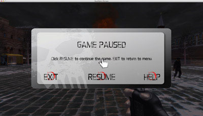
[Dead Motion](https://apps.leapmotion.com/apps/dead-motion-prologue/): 引导部分通过显示帮助菜单来展示所有的交互及优化 LeapMotion 控制器的位置。

<!--Dead Motion: Prologue displays this thorough help menu to show all of the interactions and optimal Leap Motion controller positioning.-->

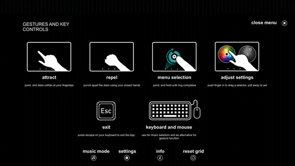
[Gravilux](https://apps.leapmotion.com/apps/gravilux/) 同样具有很好的交互逻辑。

<!--Gravilux also has a well done interaction key.-->

--

虽然你可能有足够的时间来设计自己的手势、提示和图标，但一些现有的设计可能有助于加快你的工作。其中一些专注于触摸的良好的基础可以为你设计特定的手势。

* [Gesturecons.com](http://www.gesturecons.com)
* [Gestureworks.com](http://gestureworks.com): 点击链接来获得独立的手势图标——下载矢量和位图
* [MobileTuxedo.com](http://www.mobiletuxedo.com)

<!--While you may have the resources to design your own gesture hints and icons from scratch, it may help to expedite the process by starting with some existing design assets. Some of these may focus on touch but are a good foundation for designing your specific gestures.

Gesturecons.com
Gestureworks.com: tap on the link for Individual Gesture Icons – Vector and Bitmap to download
MobileTuxedo.com-->

## 演练教程

一个演练教程是屏幕、方向或交互任务的一个系列，这将引导新用户使用你应用的不同部分。很多时候，将复杂的交互分解为不同的步骤是一个很好的办法，这能向新用户介绍你软件的使用过程。而且，像往常一样，让用户边干边学也是一个非常好的方法，这能够帮助他们熟练的掌控一个安全的环境并最终在他们使用你的软件时候能鼓励他们的信心。

<!--Walk-Through Tutorials¶
A Walk-Through Tutorial is a series of screens, directions or interactive tasks that lead new users through each different part of your app. Often times, breaking more complicated interactions down into discrete parts can be a great way to introducing new users to the mechanics of your software. And, as always, letting users learn by doing is a great way to help them master controls in a safe environment and ultimately bolster their confidence as they dive into your app.-->

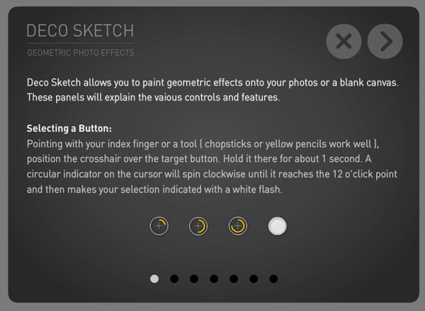
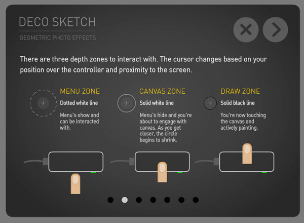
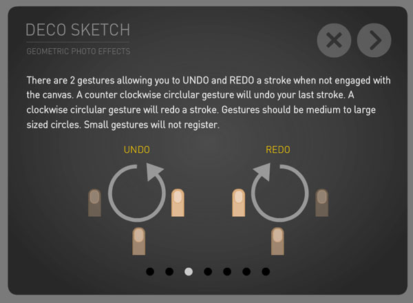
[Deco Sketch](https://apps.leapmotion.com/apps/deco-sketch/osx) 的演练教程展示了用户的手指位置如何在LeapMotion 控制器周围将 Menu 交互模式更改为 Draw 模式。

<!--This walk-through tutorial by Deco Sketch shows how the user’s finger position over the Leap Motion Controller changes the interaction from “Menu” to “Draw” modes.-->

## 应用内提示
在用户和你的软件进行交互时，为用户给予适当的提示，是一种更加优雅巧妙的行为。简单的上下文图形搭配指令（比如手型+『点击选择』）能够引导用户进行正确的交互。然而，更重要的是确保这些提示竟可能的不会导致用户分心。

<!--In-App Cues / Hints
Giving hints or cues to a user while they are interacting with your software can be an elegant way to subtly direct behavior. Simple contextual graphics paired with instructions (e.g. a pointing hand + “Tap to Select”) can go a long way in guiding users in the right direction. It is important, however, to make sure that these cues are as unobtrusive as possible and only support the experience vs. distracting from it.-->

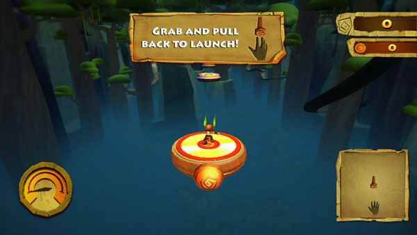
[Jungle Jumper](https://apps.leapmotion.com/apps/jungle-jumper/) 显示了应用内的提示，右下角的 HUD 同事显示了手的实时反馈。

<!--Jungle Jumper displays in-app cues as well as a small HUD in the lower right corner to show you real-time feedback of your hand.-->

Jungle Jumper 右下角有一个平视显示器(Heads Up Display, HUD) ，当用户在玩游戏时能提供一些附加提示。虽然并不是每一个应用程序都必须这么做，但是这种视觉反馈可以为用户提供使用 LeapMotion 情景很有帮助。

<!--The Heads Up Display (HUD), shown in the lower right corner of Jungle Jumper, gives the user additional feedback as to their hand position and state. While not necessary for every app, this sort of visual feedback can be very helpful in describing to the user the extent of the Leap Motion interaction zone and what is being detected by the device.-->

每次你获得一个新技能时，[Wooden Sen’SeY](https://airspace.leapmotion.com/apps/wooden-sen-sey/) 都会在游戏内显示一个提示来引导用户如何使用。
<!--Every time you receive a new skill, Wooden Sen’SeY displays an in-app cue to teach you the move.-->

## 控制演示

教程里的实时控制提供了一个交互方式的教学体验方法，这要求用户在执行一些简单朴素的菜单选择任务。这就是『边学边做』，这是一种创造性的方法在你的应用里增加手势。提供这些教程取决于你应用的复杂度，一个练习模式将会非常值得。

<!--
Controls As Demos
Live controls in the tutorials provides an experiential approach to teaching interactions by requiring users to perform certain simple tasks in menu selections or discreet tutorial mode. This is truly ‘learning by doing’ and can be a creative way to reinforce gestures that are core to your app. Depending upon the complexity of your application, providing these interactive tutorials or a practice mode might be worthwhile.
-->

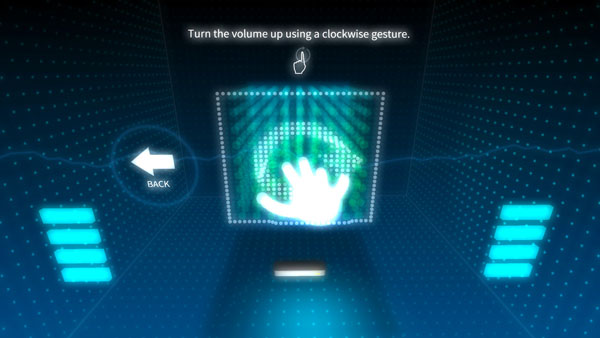

[HandWAVE](https://apps.leapmotion.com/apps/handwave/) 提供了一个复杂的交互教程。
<!--HandWAVE provides a comprehensive interactivetutorial.-->

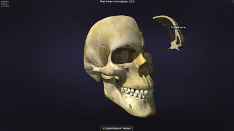

[Cyber Science 3D Motion](https://apps.leapmotion.com/apps/cyber-science-motion/) 里设置了一段交互教程能够引导用户如何执行所需的任务。

<!--Cyber Science 3D Motion has an interactivetutorial that teaches you how to perform the tasks needed within the app.-->

无论你最后在应用里设置怎样的教程，都要换位思考如果你是用户会需要什么。正如你所看到的这些例子一样，在适当的位置添加一些额外的说明将会非常有帮助。

<!--
Whichever tutorial option you provide in your application, put yourself in the user’s shoes and give them what they need to succeed within your app. As you can see from some of the above examples, additionally including some indication as to the best position of the user’s hands in relation to the Leap Motion Controller (this may differ depending on the application) can be extremely helpful.
-->

## 在需要时提供帮助

最后，确保让用户能在你应用的任何位置直观的访问这些教程，我们强烈推荐这个教程在你应用第一次启动的时候进行展示。在应用里，如果可以，这些教程最好能够通过直观、连续的在主菜单的帮助一栏中访问。

<!--
Help When and Where You Need It
Lastly, be sure that you enable the user to intuitively access these tutorials and help screens from anywhere within your application. We highly recommend that a tutorial is shown upon the very first entry into the app. Within the app, the tutorials could be accessed via an explicit and persistent “Help” or “?” icon or via the main menu, if applicable.

No matter how simple your app may be, a little help can go a long way. Set your users up to get the most out of your app and they will become your biggest fans.
-->

