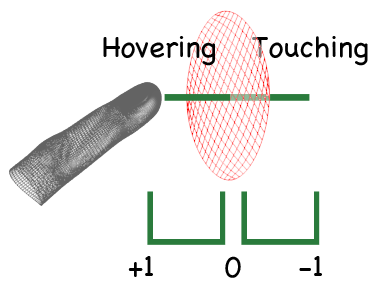

# 触摸仿真

LeapMotion API 提供了一些用于在你应用中实现触摸仿真的信息。触摸信息由 `Pointable` 类提供。

## 综述

Leap 定义了可适应的触摸平面，你可以给你应用的二维元素设计精心的交互。这个表面大致与XY平面平行，适应用户的手指和手的位置。当用户的手指达到这个平面的前方时，Leap 会给出可指向对象是接近还是已经接触到这个虚拟平面。API 会给出触摸的表面时的两个值：触摸的区域到触摸平面的距离。


*虚拟触摸平面*

触摸区可以表示 `Pointable` 对象接近触摸面、已经穿过出魔免和距离平面太远的状态（或指向了错误的方向）。这些区域分别是『Hovering』、『Touching』和『None』。

触摸的距离只当可指向对象在 Hovering 或 Touching
区域内才会有效，这个距离是[-1,1]之间的归一值。当可指向对对象首次进入 Hovering 区域时，触摸距离为 +1 并且会在触摸对象逐渐接近触摸平面时候逐渐减为 0。当`Pointable`刚好穿过表面时，距离会为0。当`Pointable`继续深入穿过平面时，距离会继续降低但不会超过-1。

你可以使用区域值来进一步更新接近接触面的 UI 元素。例如，当一个手指在位于 Hover 区域时高亮一个元素，以此来提供反馈给用户，进而表明当前的手指距离元素的接近程度。

触摸仿真作为 LeapMotion API 的一部分，除了提供给 `Pointable` 一个标准位置外，还有一个稳定位置。LeapMotion 软件会使用一个自适应滤波器对位置进行稳定，以保证用户在小区域上的交互平滑与稳定。当移动缓慢时，平滑将会达到一个理想的状态，用户便能轻松的接触到一个特定的点。

## 获取触摸区

触摸区由 `Pointable` 类的 `touchZone` 属性所表示。触摸区定义了 Zone 枚举量，分别是：

* NONE - 距离触摸面太远，要么是太前面了，要么是太里面了；
* HOVERING - 已经进入了 Hover 区，即将接触触摸面；
* TOUCHING - 可指向对象穿过了虚拟触摸面。

下面的代码段展示了如何获取最前面的手指的触摸区：

```
zone = pointable.touch_zone
```

## 获取触摸距离

触摸的位置由 `Pointable` 类中的 `touchDistance` 属性表示，表示手指在虚拟平面附近移动的距离，范围从 -1 到 +1。这个距离并不是物理距离，而是 LeapMotion 用来表示可指向对象距离触摸有多接近的一个量。

下面的代码段展示了如何获取最前面的手指的触摸位置：

```
distance = pointable.touch_distance
```

## 获取可指向对象的稳定位置

稳定位置由 `Pointable` 类的 `stabilizedTipPosition` 属性表示。这个位置以标准的 LeapMotion 坐标系统为参考，但也和大量上下文的滤波和稳定有关。

下面的代码段展示了获取最前面的手指的稳定位置：

```
frame = controller.frame()
pointable = frame.pointables.frontmost
stabilizedPosition = pointable.stabilized_tip_position
```

## 将 LeapMotion 坐标系统转换到应用的坐标系统

当实现触摸仿真时，你必须将 LeapMotion 的坐标变换到你应用程序的坐标中。为了保证这个映射足够简单，LeapMotion API 提供了 InteractionBox  这个类。`InteractionBox` 表示了 LeapMotion 视野内的一个立方体空间。这个类提供的函数可以将溶剂内的位置归一到[0,1]之间。你可以正规化这个位置然后变换到想要你应用的坐标系统中。

举个例子，如果你有一个由 `windowWidth` 和 `windowHeight` 代表的客户区大小的窗口，那么你可以获得触摸点的二维像素的坐标，代码如下：

```
frame = controller.frame()
finger = frame.fingers.frontmost
stabilizedPosition = finger.stabilized_tip_position

interactionBox = controller.frame().interaction_box
normalizedPosition = interactionBox.normalize_point(stabilizedPosition)
x = normalizedPosition.x * windowWidth
y = windowHeight - normalizedPosition.y * windowHeight
```

## 示例：TouchPoints

下面的例子使用了触摸仿真 API 来显示检测到的所有可指向对象在应用程序串口中的位置。例子中使用了触摸区的颜色来表示触摸点的状态。稳定位置使用 InteractionBox 类映射到了应用程序的窗口。

```python
from Tkinter import Frame, Canvas, YES, BOTH
import Leap

class TouchPointListener(Leap.Listener):
    def on_init(self, controller):
        print "Initialized"

    def on_connect(self, controller):
        print "Connected"

    def on_frame(self, controller):
        self.paintCanvas.delete("all")
        frame = controller.frame()

        interactionBox = frame.interaction_box
        
        for pointable in frame.pointables:
            normalizedPosition = interactionBox.normalize_point(pointable.tip_position)
            if(pointable.touch_distance > 0 and pointable.touch_zone != Leap.Pointable.ZONE_NONE):
                color = self.rgb_to_hex((0, 255 - 255 * pointable.touch_distance, 0))
                
            elif(pointable.touch_distance <= 0):
                color = self.rgb_to_hex((-255 * pointable.touch_distance, 0, 0))
                #color = self.rgb_to_hex((255,0,0))
                
            else:
                color = self.rgb_to_hex((0,0,200))
                
            self.draw(normalizedPosition.x * 800, 600 - normalizedPosition.y * 600, 40, 40, color)

    def draw(self, x, y, width, height, color):
        self.paintCanvas.create_oval( x, y, x + width, y + height, fill = color, outline = "")

    def set_canvas(self, canvas):
        self.paintCanvas = canvas
        
    def rgb_to_hex(self, rgb):
        return '#%02x%02x%02x' % rgb
        
class PaintBox(Frame):
    def __init__( self ):
        Frame.__init__( self )
        self.leap = Leap.Controller()
        self.painter = TouchPointListener()
        self.leap.add_listener(self.painter)
        self.pack( expand = YES, fill = BOTH )
        self.master.title( "Touch Points" )
        self.master.geometry( "800x600" )
      
        # create Canvas component
        self.paintCanvas = Canvas( self, width = "800", height = "600" )
        self.paintCanvas.pack()
        self.painter.set_canvas(self.paintCanvas)

def main():
    PaintBox().mainloop()

if __name__ == "__main__":
    main()
```
这个例子使用了 Tkinter，但是 LeapMotion 相关的代码适用于所有的 Python 项目。