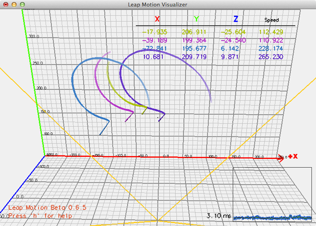

# 使用可视化诊断工具

这篇文章描述了 LeapMotion 的可视化诊断工具，它能够帮助你查看 LeapMotion 控制器生成的运动的追踪数据。这篇文章不描述面向消费者的可视化工具。

<!--This article describes the Leap Motion Diagnostic Visualizer tool that lets you view motion tracking data generated by the Leap Motion Controller. This article does not describe the consumer-facing visualizer.-->

## 概览
可视化工具应用显示了有 LeapMotion API 提供的追踪数据，这是一个很好的方式来感受 Leap 所产生的数据。在 LeapMotion 设置对话框中能启动这个工具。

现在将你的手移动到 LeapMotion 控制器的视野中，就会看见你手指的表示以及指尖指向的彩色箭头。

<!--
Overview¶
The Visualizer application displays a variety of tracking data provided by the Leap Motion API and is a good way to get a feel for the data produced by the Leap. Start the Visualizer from the Troubleshooting page of the Leap Motion Settings dialog by clicking the Diagnostic Visualizer button.

Now move your hands in the Leap Motion controller’s field of view. You should see your fingers represented as colored arrows with trails following your finger tip locations.-->

## 通用控制

你可以通过键盘指令来控制可视化工具。按下两次 H 可以显示这些指令。

* **Esc** 退出
* **H** 显示可视化工具的帧率、LeapMotion 的帧率及提示信息
* **S** 切换全屏和窗口模式
* **Z**  — 翻转 z 轴的方向
* **G** — 切换坐标网格
* **J** — 在黑色、蓝色或白色背景之间切换
* **I** — 切换之间的轨迹样式
* **Y** — 切换之间的绘制样式
* **L** — 显示追踪信息，包括坐标轴的标注、视野、指尖坐标以及处理延时
* **T** — 在线型和圆柱体之间切换显示手指。在圆柱体模式下，圆柱体的颜色取决于 LeapMotion 是否将其视为同一种对象。在线型模式下，颜色则会在第一次被识别时，随机分配给每个对象
* **N** — 在手指、手掌平面和手球模式中循环显示追踪的数据
* **F** — 切换显示的原始图像
* **O** — 切换显示的手势指示器
* **P** — 暂停或开始可视化显示
* **B** — 显示屏幕位置的视觉效果。注意，屏幕特性目前不在 API 中支持
* **.** — 镜像可视化工具窗口（屏幕位置的视觉效果也必须为镜像监视器显示）的屏幕内容
* **D** — 切换触摸仿真绘制模式
* **Space** — 清除当前屏幕中的任何绘制

<!--
General controls
You can control the Visualizer with key commands. Press H twice to display the available commands.

Esc — Quit the Visualizer.
H — Display the Visualizer framerate, Leap Motion framerate, and key commands.
S — Switch between windowed mode and fullscreen.
Z — Flip the positive and negative directions of the z-axis.
G — Toggle the coordinate grid.
J — Switch between black and blue or white and gray (Jony mode).
I — Toggle interpolation of finger tip trails.
Y — Toggle artistic drawing of finger tip trails.
L — Display tracking info, including labeled axes, field of view, finger tip coordinates, and processing latency.
T — Toggles the display of fingers and tools between lines and cylinders. In cylinder mode, the cylinders are colored differently depending on whether the Leap Motion software classifies the object as a tool or a finger. In line mode, a color is randomly assigned to each object when it is first recognized.
N — Cycles the display of palm tracking data between fingers only, palm plane, and hand ball modes.
F — Toggles the display of raw stereo images.
O — Toggles the display of gesture indicators.
P — Pauses and unpauses the visualization display.
B — Displays screen location visuals. Note that the Screen feature is not currently supported in the API.
. — Mirrors the screen contents in the visualizer window (screen location visuals must also be displayed for the mirrored monitor to be shown).
D — Toggles the touch emulation drawing mode.
Space - Clear the any drawing currently on screen.-->

## 相机控制
可视化工具显示手指指尖的3D 位置。你可以使用下面的按键来控制相机：

* **=** — 放大相机
* **-** — 缩小相机
* **V** — 循环切换相机的显示模式
* **A** — 当追踪手指处于显示区域边缘时是否自动移动相机视野
* **C** — 重新定位相机追踪的中心视野
* **左右键** — 启动或停止视野旋转
* **鼠标左右拖拽** — 旋转相机视野
* **鼠标右键左右拖拽** — 平移相机

<!--
Camera controls
The Visualizer displays finger tip trails in 3D space. You can control the camera with the following keys:

= — Zoom the camera in.
- — Zoom the camera out.
V — Cycle the camera between the view modes.
A — Automatically pan the camera to keep tracked fingers in view when they move near the edges.
C — Recenter the camera to place tracked fingers in the center of the view.
Left and right arrows — Start and stop view rotation in orthographic view.
Mouse click and drag — Rotate the camera in orthographic view.
Mouse right-click and drag — Pan the camera.
-->

## 追踪信息
你可以使用 `L` 键查看一些关于追踪数据的辅助信息。

<!--
Tracking information¶
You can view additional information about the tracking data by pressing the L key.-->

*LeapMotion 可视化工具展示的辅助追踪数据。*

在这种模式下：

* 标注的轴被添加到网格中，以毫米为单位。
* 一个倒置的金字塔来显示 LeapMotion 的大致视野。
* x, y, z 坐标显示的是手指的位置，以毫米为单位。
* 左下角的图形显示了处理的延时，以毫秒为单位。

<!--
The Leap Motion Visualizer showing additional tracking data.

In this mode:

Labeled axes are added to the grid, with scale measured in millimeters.
An inverted pyramid indicates the approximate field of view of the Leap Motion Controller.
The x, y, z coordinates of each detected finger tip’s position are shown, in millimeters.
A graph shows the amount of processing latency experienced over time, in milliseconds.-->